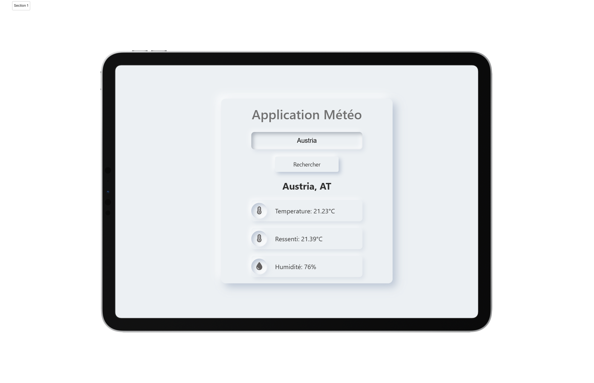

🖼️ Preview

  

Gauche : Vue tablette — Droite : Vue mobile

## Application Météo
Une application météo responsive avec un design en neumorphisme doux. 
L'utilisateur peut entrer le nom d'une ville pour obtenir les données en temps réel de température, ressentie, et humidité via une API externe.

## Fonctionnalités
- Données météo en temps réel (température, température ressentie, humidité)
- Interface utilisateur en neumorphisme
- Design adaptatif (tablette et mobile)
- Développée avec HTML, CSS, JavaScript
- Fetch API pour récupérer les données
- OpenWeatherMap API

## 🚀 Démo en ligne - 🔗 https://nbhd12.github.io/weatherapp

---

## Weather App (EN)

A responsive weather application using a soft neumorphism design.

## Features
- Real-time weather data (temperature, feels-like, humidity)
- Neumorphism user interface
- Responsive design (tablet & mobile)
- Built with HTML, CSS, JavaScript
- Fetch API for retrieving data
- OpenWeatherMap API

## Live Demo - 🔗 https://nbhd12.github.io/weatherapp
